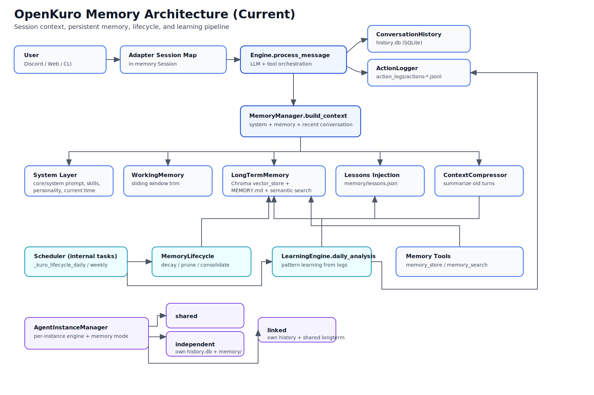
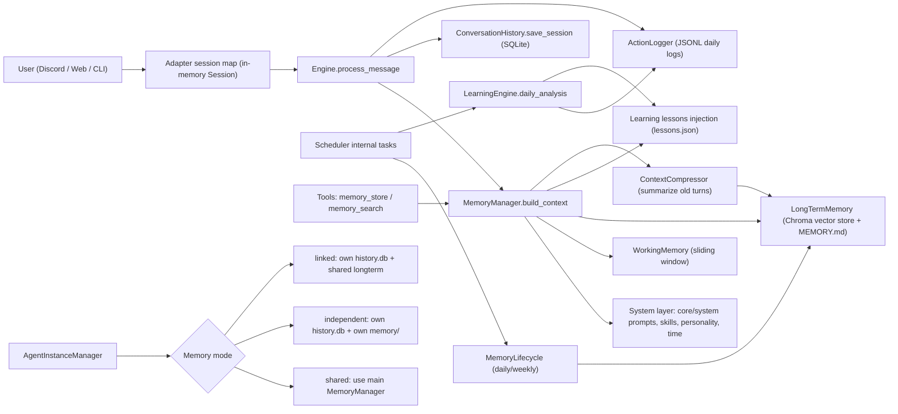

# Memory Architecture (Current)

This document describes the current memory architecture implemented in OpenKuro.

## High-Level Diagram

Rendered diagram (recommended view):



If your Markdown viewer does not support image embedding, open:
`docs/MEMORY_ARCHITECTURE.svg`

Quick ASCII fallback:

```text
User (Discord/Web/CLI)
  -> Adapter Session Map (in-memory Session)
  -> Engine.process_message
     -> MemoryManager.build_context
        -> System layer (core/system/personality/skills/time)
        -> WorkingMemory (sliding window)
        -> LongTermMemory (Chroma + MEMORY.md)
        -> Lessons injection (lessons.json)
        -> ContextCompressor (old turn summary)
     -> ConversationHistory.save_session (SQLite)
     -> ActionLogger (daily JSONL)

Scheduler tasks
  -> MemoryLifecycle (daily/weekly)
  -> LearningEngine.daily_analysis
     -> updates lessons + action-log insights

AgentInstanceManager
  -> shared      (main MemoryManager)
  -> independent (own history.db + own memory/)
  -> linked      (own history.db + shared long-term memory)
```

Mermaid source:



## Storage Layout

Main runtime data (default under `~/.kuro`, configurable by `KURO_HOME`):

| Purpose | Path |
|---|---|
| Conversation history DB | `~/.kuro/history.db` |
| User-editable memory file | `~/.kuro/memory/MEMORY.md` |
| Vector memory store (ChromaDB) | `~/.kuro/memory/vector_store/` |
| Action logs (daily JSONL) | `~/.kuro/action_logs/actions-YYYY-MM-DD*.jsonl` |
| Learned lessons | `~/.kuro/memory/lessons.json` |
| Model performance stats | `~/.kuro/memory/model_stats.json` |

Primary agent instances:

- Instance root: `~/.kuro/agents/<instance_id>/`
- Independent mode: own `history.db` and own `memory/`
- Linked mode: own `history.db`, shared long-term memory object
- Shared mode: uses main memory manager directly

## Runtime Context Build Order

`MemoryManager.build_context()` assembles context in this order:

1. Core prompt (encrypted base layer)
2. System prompt
3. Current time block
4. Personality file (`personality.md`)
5. Active skills
6. `MEMORY.md` content
7. Long-term semantic retrieval (RAG)
8. Learned lessons injection
9. Recent conversation window (working memory trim)
10. Optional context compression

## Maintenance and Learning

- Daily memory lifecycle:
  - Recompute memory importance scores
  - Flag low-importance memories
- Weekly lifecycle:
  - Prune low-importance memories
  - Consolidate similar memories
  - Reorganize `MEMORY.md` when too large
- Daily learning:
  - Analyze action logs
  - Detect recurring errors / slow tools
  - Write lessons into `lessons.json`

## Main Source Files

- `src/core/memory/manager.py`
- `src/core/memory/longterm.py`
- `src/core/memory/history.py`
- `src/core/memory/working.py`
- `src/core/memory/compressor.py`
- `src/core/memory/lifecycle.py`
- `src/core/learning.py`
- `src/core/action_log.py`
- `src/core/agent_instance_manager.py`
- `src/main.py`
