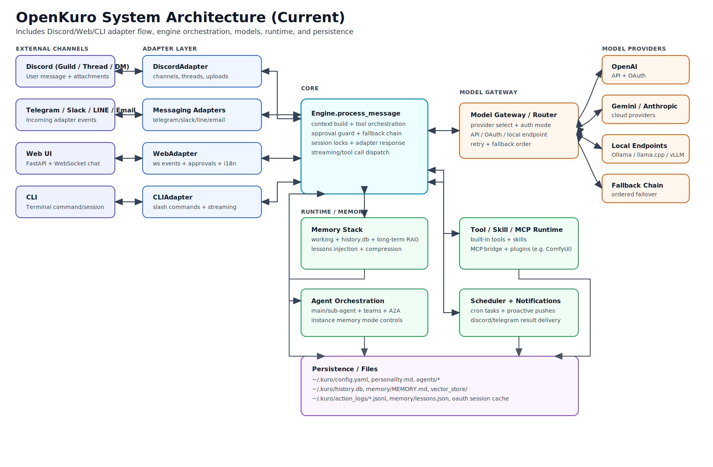

# System Architecture (Current)

This document describes the current end-to-end system architecture in OpenKuro, including Discord/Web/CLI/message-platform integration.

## High-Level Diagram

Rendered diagram (recommended view):



If your Markdown viewer does not support embedded images, open:
`docs/SYSTEM_ARCHITECTURE.svg`

Quick ASCII fallback:

```text
Discord / Web / CLI / Messaging Platforms
  <-> Adapter Layer (DiscordAdapter, WebAdapter, CLIAdapter, MessagingAdapters)
  <-> Core Engine (context + tools + approvals + model fallback)
       <-> Model Gateway (API / OAuth / local endpoints)
            <-> OpenAI / Gemini / Anthropic / Local LLMs
       <-> Memory Stack (working/history/long-term/lessons/compression)
       <-> Tool-Skill-MCP Runtime (built-ins, skills, MCP bridge, plugins)
       <-> Agent Orchestration (main/sub agents, teams, A2A)
       <-> Scheduler + Notifications (cron tasks + proactive pushes)
       -> Persistence (~/.kuro config/history/memory/logs/agents)
```

## Discord Connection Flow (End-to-End)

1. User sends message/attachment in Discord channel, thread, or DM.
2. `DiscordAdapter` receives event and normalizes context/session metadata.
3. Adapter sends request to `Engine.process_message`.
4. Engine builds context from memory/history and decides tool/model route.
5. If needed, engine executes tools/MCP/skills and calls model gateway.
6. Engine returns final text + optional files/images.
7. `DiscordAdapter` posts response back to the same Discord context (channel/thread/DM).

## Core Components

- Adapter Layer:
  - DiscordAdapter
  - WebAdapter (FastAPI + WebSocket)
  - CLIAdapter
  - Messaging adapters (Telegram/Slack/LINE/Email)
- Core Engine:
  - Context assembly
  - Tool orchestration + approvals
  - Model routing + fallback
  - Session locks/stream handling
- Runtime:
  - Memory stack
  - Tool/Skill/MCP runtime
  - Agent orchestration
  - Scheduler + proactive notifications
- Persistence:
  - `~/.kuro/config.yaml`
  - `~/.kuro/history.db`
  - `~/.kuro/memory/`
  - `~/.kuro/action_logs/`
  - `~/.kuro/agents/`

## Related Docs

- Memory architecture: `docs/MEMORY_ARCHITECTURE.md`
